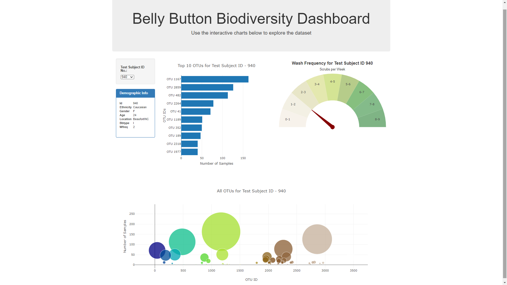

# Plotly - Belly Button Biodiversity Dashboard

This project is to build an interactive dashboard to explore the Belly Button Biodiversity dataset. The dataset reveals that a small handful of microbial species (also called operational taxonomic units, or OTUs, in the study) were present in more than 70% of people, while the rest were relatively rare.

## Interactive Dashboard
Created an interactive dashboard that displays Bar plot, Gauge Plot, Bubble plot and Demographic Info of any Test Subject ID that the user is interested in.

## Programming Language / Applications - Used
  * HTML
  * CSS
    - Bootstrap
  * Javascript
    - Plotly.js
    - D3.js
  * JSON

Interactive Dashboard App is deployed in Github and Heroku: 
- [https://ushaakumaar.github.io/plotly-dashboard/](https://ushaakumaar.github.io/plotly-dashboard/)
- [https://plotly-bellybutton-dashboard.herokuapp.com/](https://plotly-bellybutton-dashboard.herokuapp.com/)

---

## Contributors

- Usha Saravanakumar (ushaakumaar@gmail.com)
